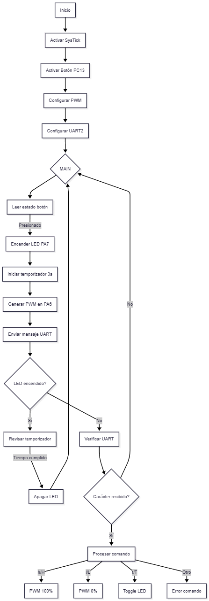

# Taller Práctico: Sistema de Control Básico en C Puro (STM32L476RG)
 

**Universidad Nacional de Colombia - Sede Manizales**
**Curso:** Estructuras Computacionales (4100901)
**Nombre:** Hernan Jair Telpiz_1193069571

# Adecuaciones que se realizaron
# link:  https://youtube.com/shorts/oTb5gT1Y4ME?si=bo3Vw6Cwo_LKTjxN

**¿Qué hace este sistema?**
Este proyecto controla luces LED en una habitación usando un microcontrolador STM32. 

Parpadea un LED  para mostrar que está funcionando 

Enciende una led (LD2) por 3 segundos cuando presionas un botón (B1)

Regula el brillo de el led en el pin (PA6)  usando el pwm

Responde a mensajes que le envías mediante (uart2) usando la terminal serial 

**¿Qué se añadió al código base?**
**Se uso algunas funciones para el siguiente funcionamiento:**

1. Lógica para manejar pulsaciones de botón con anti-rebote:  Implementamos un sistema que detecta pulsaciones válidas ignorando fluctuaciones eléctricas (rebotes) mediante un delay de 200ms entre pulsaciones.

2. Temporizadores precisos usando el reloj interno: Usamos el SysTick del Cortex-M4 para mediciones de tiempo exactas, permitiendo:
    * Parpadeo preciso del LED heartbeat (500ms)
    * Temporización exacta de 3 segundos para el LED externo

3. Comandos por USB/UART para control remoto : 
    * 'h' -> PWM al 100% 
    * 'l' -> PWM al 0%
    * 't' -> ON/OFF

4. PWM (modulación por ancho de pulso) para control de brillo
    *Frecuencia base de 1kHz
    *Rango de duty cycle de 0-100%

  
Configuracion Relog de sistema

* Frecuencia del reloj:
El sistema opera a 4 MHz usando el HSI como fuente de reloj principal.

## SysTick

* Características:

    * Acceso directo a registros 

    * Frecuencia de interrupción: 1 kHz (cada 1 ms)

    * Resolución temporal: 1 ms 

    * Uso:

        * Base de tiempo para el LED heartbeat (500 ms)

        * Temporizador de 3 segundos para el LED ON/OFF

        * Medición de intervalos para anti-rebote
## PWM
* Especificaciones:

    * Timer usado: TIM3, Canal 1 (PA6)

    * Rango de frecuencia: 100Hz a 10kHz configurable

    * Resolución PWM: 10 bits efectivos (0-100% en pasos de ~0.1%)

    * Duty cycle inicial: 70%

## Interrupciones

* Flujo de interrupciones:

    * Botón: EXTI → NVIC → EXTI15_10_IRQHandler()

    * UART: USART → NVIC → USART2_IRQHandler()

    * SysTick: Interrupción directa → SysTick_Handler()

  
Configuracion de pines

1. Led Heratbeat(LD2 integrado):
    * Pin fisico : PA5
    * Indica la actividad del sistema (Parpadea cada 500ms)

**Configuracion**

* gpio_setup_pin(GPIOA, 5, GPIO_MODE_OUTPUT, 0);
*    GPIOA 5
* Modo  Salida (GPIO_MODE_OUTPUT)

2. LED Externo (Control ON/OFF):

    * Pin físico: PA7

    * Encendido manual o por temporizador

    * Se apaga automáticamente después de 3 segundos

    **Configuración:**

    - gpio_setup_pin(GPIOA, 7, GPIO_MODE_OUTPUT, 0);

    - GPIOA 7

    - Modo: Salida digital push-pull

3. LED PWM (Control de intensidad):

    * Pin físico: PA6

    * Control de brillo mediante PWM

    * Frecuencia base: 1kHz

    * Rango de intensidad: 0-100%

    **Configuración:**

    - gpio_setup_pin(GPIOA, 6, GPIO_MODE_AF, 2);

    - GPIOA 6

    - Modo: Función alternativa (GPIO_MODE_AF)

    - AF: 2 (TIM3_CH1) (Funcion alternatia)

4. Botón de Usuario (B1):

    * PC13

    * Detección de pulsaciones con anti-rebote

    * Genera interrupción en flanco de bajada

    **Configuración:**

    - gpio_setup_pin(GPIOC, 13, GPIO_MODE_INPUT, 0);

    - GPIOC 13

    - Entrada digital

    - Resistencia pull-up interna activada

5. UART TX (Comunicación serial):

    * Transmisión de datos a PC

    * Velocidad: 115200 baudios

    **Configuración:**

    - gpio_setup_pin(GPIOA, 2, GPIO_MODE_AF, 7);

    - GPIOA 2

    - Modo: Función alternativa

    - AF: 7 (USART2_TX)

6. UART RX (Comunicación serial):

    * Recepción de comandos desde PC

    * Eco automático de caracteres recibidos

    **Configuración:**

    -  gpio_setup_pin(GPIOA, 3, GPIO_MODE_AF, 7);

    -  GPIOA 3

    - Modo: Función alternativa

    -  AF: 7 (USART2_RX)

  
Aplicaciones de los difernetes codigos

1. main.c 

* Propósito: Es el núcleo del programa. Aquí se inicializan todos los periféricos y se llama a la función principal de control.

**Detalles:**

* Llama a room_control_app_init() para configurar el estado inicial del LED.

* Inicia un bucle infinito donde el microcontrolador espera eventos (como interrupciones del botón o UART).

2. room_control.c/h

    * Propósito: Implementa la lógica principal del control de la habitación.

    **Detalles:**

    * Maneja el botón (con anti-rebote) para alternar el LED entre encendido/apagado.

    * Procesa comandos UART (H, L, T) para ajustar el brillo del LED.

    * Usa funciones de gpio.c, tim.c, y uart.c para interactuar con el hardware.

3. gpio.c/h

    * Propósito: Configura los pines del microcontrolador.

    **Detalles:**

    * Define el pin del LED como salida (ejemplo: PA5).

    * Configura el botón (ejemplo: PC13) como entrada con resistencia pull-up para evitar ruido.

4. uart.c/h

    * Propósito: Maneja la comunicación serial (UART) para recibir comandos y enviar mensajes.

    **Detalles:**

    *  Inicializa USART2 a 115200 baudios.

    * Proporciona funciones como uart2_send_string() para enviar mensajes (ejemplo: "LED encendido al 50%").

5. tim.c/h

    * Propósito: Configura el temporizador TIM3 para generar una señal PWM y controlar el brillo del LED.

    **Detalles:**

    * PWM en PA6 con frecuencia de 1 kHz y resolución de 10 bits (valores de 0 a 1023).

    * La función tim3_ch1_pwm_set_duty_cycle(50) ajusta el brillo al 50%.

6. systick.c/h

    * Propósito: Proporciona retardos precisos usando el temporizador SysTick del Cortex-M4.

    **Detalles:**

    * Se usa para el anti-rebote del botón (ejemplo: esperar 200 ms antes de leer otra pulsación).

    * Función clave: systick_get_current_ticks() para medir tiempo.

7. stm32l4xx_it.c

    * Propósito: Contiene las interrupciones (manejadores de eventos en tiempo real).

    **Detalles:**

    * EXTI (Interrupción del botón): Llama a room_control_on_button_press() cuando se presiona el botón.

    * USART2 (UART): Llama a room_control_on_uart_receive() cuando llega un comando por serial.

    * SysTick: Actualiza un contador interno para retardos.
    

# Diagrama de funcionamiento en mermaid.live

